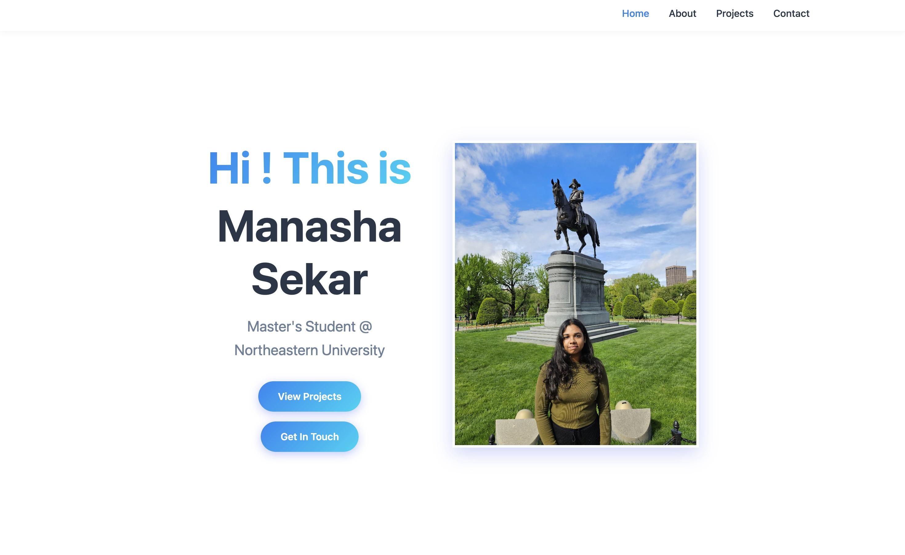
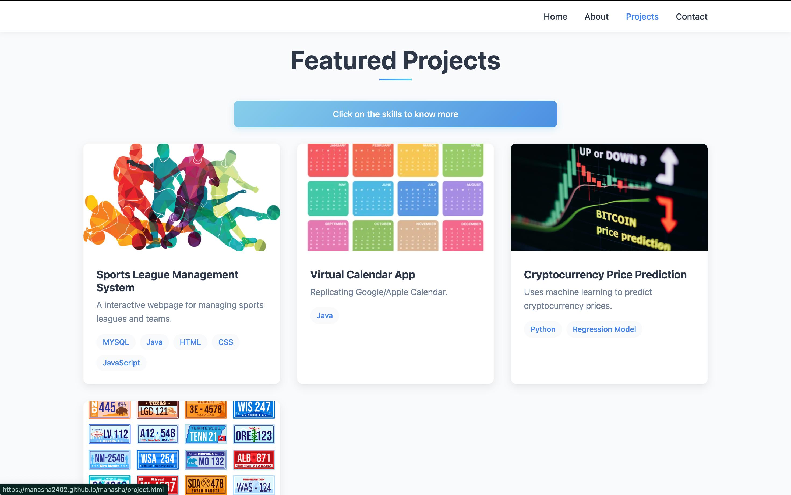
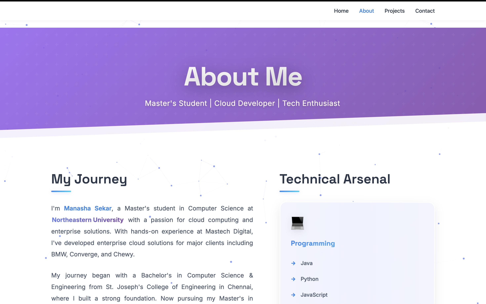
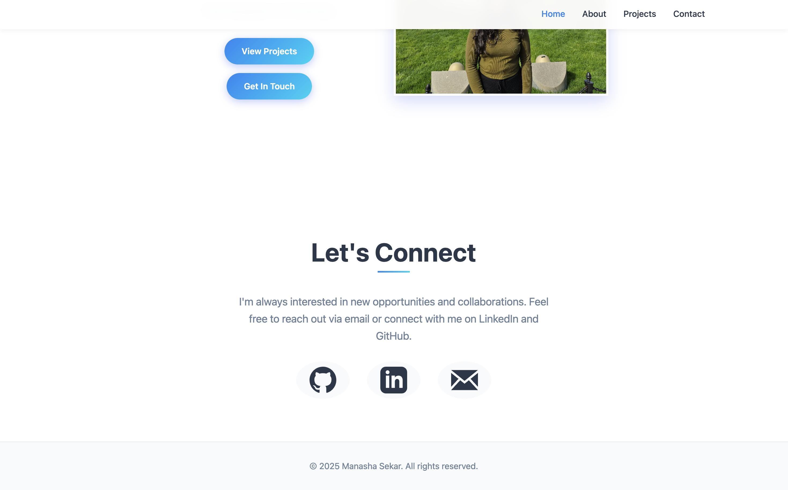

# Homepage

## Author
**Manasha Sekar**  
Master's Student in Computer Science  
Northeastern University, Boston, MA  
Email: sekar.ma@northeastern.edu

## Class Link
**Course**: Web Development - CS5610 <br>
**Link**: [https://johnguerra.co/classes/webDevelopment_online_fall_2025/ ](https://johnguerra.co/classes/webDevelopment_online_fall_2025/)

## Live Demo & Resources
 **Live Page**: [https://manasha2402.github.io/manasha/](https://manasha2402.github.io/manasha/)  
 **Presentation**: [Google Slides](https://docs.google.com/presentation/d/1LiuMBWMMNwHjTKqknJYLMAewl_WfCW9oyKhgABX9Lr8/edit?usp=sharing)

## Screenshot





## Design Document
[Design Documents](Design_Documents.pdf)

## Creative Addition
**Skills can be web searched**: While viewing the project page, you can click on the skill set available for the particular project to access its documentation.


## Instructions to Build

### Prerequisites
- Node.js (v14 or higher)
- npm or yarn package manager
- Modern web browser (Chrome, Firefox, Safari, Edge)

### Installation Steps
1. **Clone the repository**
   ```bash
   git clone https://github.com/manasha2402/manasha.git
   ```

2. **Install dependencies**
   ```bash
   npm install
   ```

3. **Run development server**
   ```bash
   npm http-server
   ```
   The site will be available at `http://localhost:3000`


## License
This project is licensed under the MIT License - see the [LICENSE](LICENSE) file for details.

```
MIT License

Copyright (c) 2025 manashasekar

Permission is hereby granted, free of charge, to any person obtaining a copy
of this software and associated documentation files (the "Software"), to deal
in the Software without restriction, including without limitation the rights
to use, copy, modify, merge, publish, distribute, sublicense, and/or sell
copies of the Software, and to permit persons to whom the Software is
furnished to do so, subject to the following conditions:

The above copyright notice and this permission notice shall be included in all
copies or substantial portions of the Software.

THE SOFTWARE IS PROVIDED "AS IS", WITHOUT WARRANTY OF ANY KIND, EXPRESS OR
IMPLIED, INCLUDING BUT NOT LIMITED TO THE WARRANTIES OF MERCHANTABILITY,
FITNESS FOR A PARTICULAR PURPOSE AND NONINFRINGEMENT. IN NO EVENT SHALL THE
AUTHORS OR COPYRIGHT HOLDERS BE LIABLE FOR ANY CLAIM, DAMAGES OR OTHER
LIABILITY, WHETHER IN AN ACTION OF CONTRACT, TORT OR OTHERWISE, ARISING FROM,
OUT OF OR IN CONNECTION WITH THE SOFTWARE OR THE USE OR OTHER DEALINGS IN THE
SOFTWARE.
```

## Use of GenAI Tools
### Tool Used
**Claude 3.5 Sonnet** (Anthropic) - Latest version

### How It Was Used
1. **Initial Structure Generation**
   - Prompt: "What are all the details required to create a personal homepage?"
   - Used to brainstorm ideas. What and what not to add.
     
2. **About page**
   - Prompt: "Create an About page with my resume attached below."
   - Modified a bit to match the color palette.

3. **Debugging Support**
   - Used for troubleshooting ESLint configuration issues
   - Helped resolve CSS alignment problems with flexbox properties
